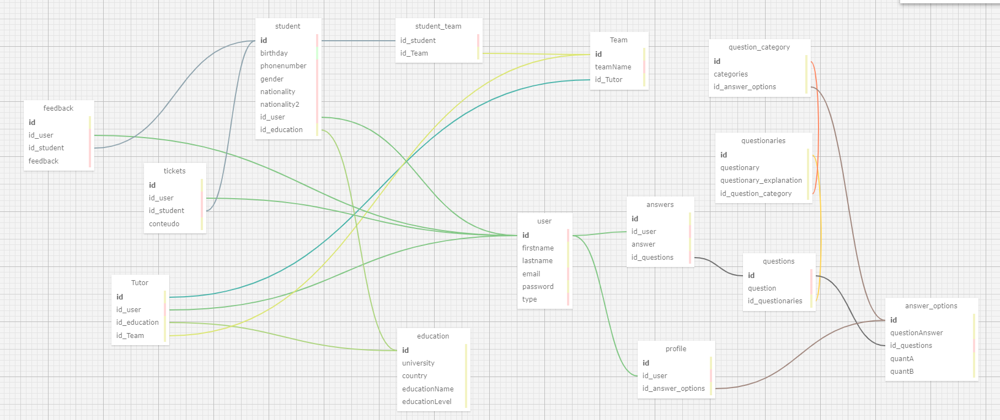

# Modelo Relacional do Banco de Dados

Ana Beatriz Passos Beggiato
Turma 12 - Grupo 3

- **Entidade:** 
  - *user*: armazenamento de dados do usuário. Todos os atributos dessa entidade serão inseridos no banco de dados no ato de cadastro na plataforma.

- **Atributos:** 
  - *id*: chave de identificação dos dados. Utilizada como chave primária para consultas ao banco. Esse atributo será chave estrangeira nas entidades *student* (1:1), *feedback*(1:n), *tutor*(1:1), *answers*(1:n), *profile*(1:1) e *tickets*(1:n);

  - *firstname*: armazena o primeiro nome do usuário. Essa informação será utilizada, principalmente, na tela de perfil e nas telas de avaliação (autoavaliação, avaliação de pares e feedback);

  - *lastname*: armazena o último nome do usuário, para fins de identificação. Será impresso na área de boas vindas da tela de perfil.

  - *email*: armazena o email do usuário, necessário para fazer login na página.

  - *password*: armazena a senha de acesso ao usuário, sendo, também, necessária para fazer login.

  - *type*: armazena o tipo de usuário, se ele é tutor ou estudante. A depender da resposta, verifica o tipo de acesso ao site.

- **Entidade:** 
  - *student*: entidade utilizada para guardar os dados do usuário identificado como estudante, permitindo a obtenção de algumas informações sobre ele além daquelas que já foram declaradas no cadastro.

- **Atributos:** 
  - *id*: chave de identificação dos dados. Utilizada como chave primária para consultas ao banco. Esse atributo será chave estrangeira nas entidades *student_team*(n:1), *feedback*(1:1) e *tickets*(1:n).

  - *birthday*: armazena a data de nascimento do estudante, apenas para fins de cadastro.

  - *phonenumber*: armazena o telefone do estudante, apenas para fins de cadastro.

  - *gender*: armazena o gênero do estudante, apenas para fins de cadastro.

  - *nationality*: armazena a nacionalidade do estudante. Essa informação será mostrada na tela de time, que tem como principal funcionalidade apresentar ao usuário os seus teammates.

  - *nationality2*: armazena a segunda nacionalidade de um usuário, caso ele possua uma, sendo usada apenas para fins de cadastro.

  - *id_user*: chave estrangeira oriunda da entidade "user", esse atributo retorna o id do usuário, sendo usado para relacionar as duas entidades ("user" e "student"), permitindo a criação de uma usuário estudante. Aqui, a relação de cardinalidade de *id_user* e *student* é de um para um, ou seja, cada id de usuário se relaciona a apenas um estudante.

  - *id_education*: chave estrangeira oriunda da entidade "education", esse atributo retorna o id da instituição educacional do estudante, permitindo a obtenção de informações sobre a universidade na qual ele estuda. Aqui, a relação de cardinalidade de *id_education* e *student* é de um para muitos, visto que cada instituição educacional pode ter mais de um aluno participando do jogo.

- **Entidade:** 
  - *tutor*: entidade utilizada para guardar os dados do usuário identificado como tutor, permitindo a ele acesso a uma tela diferente da dos estudantes, visto que ele precisa acessar mais de um time.

- **Atributos:** 
  - *id*: chave de identificação dos dados. Utilizada como chave primária para consultas ao banco. Esse atributo será chave estrangeira na entidade *team*(1:n).

  - *id_user*: chave estrangeira oriunda da entidade "user", esse atributo retorna o id do usuário, sendo usado para relacionar as duas entidades ("user" e "tutor"), permitindo a criação de uma usuário tutor. Aqui, a relação de cardinalidade de *id_user* e *tutor* é de um para um, ou seja, cada id de usuário se relaciona a apenas um tutor.

  - *id_education*: chave estrangeira oriunda da entidade "education", esse atributo retorna o id da instituição educacional do tutor, permitindo a obtenção de informações sobre a universidade na qual ele leciona. Aqui, a relação de cardinalidade de *id_education* e *tutor* é de um para muitos, visto que cada instituição educacional pode ter mais de um tutor participando do jogo.

  - *id_team*: chave estrangeira oriunda da entidade "team", esse atributo é responsável por atribuir a cada tutor os seus respectivos times. Aqui, a relação de cardinalidade de *id_team* para *tutor* é de muitos para um, visto que um tutor pode ter mais de um time, mas cada time tem, necessariamente, um tutor.

- **Entidade:**
    - *education*: entidade utilizada para guardar os dados educacionais dos participantes do jogo, permitindo uma organização melhor deles e um melhor acesso a essas informações no banco de dados.

- **Atributos:**
  -  *id*: chave de identificação dos dados. Utilizada como chave primária para consultas ao banco. Nesse caso, será chave estrangeira nas entidades *tutor*(1:1) e *student*(1:1).

  - *university*: armazena o nome da universidade participante do jogo, informação essa que será mostrada aos usuários na tela de time, a fim de que eles saibam onde os seus teammates estudam.

  - *country*: armazena o nome do país no qual se localiza a universidade em questão, informação essa que também será mostrada aos usuários na tela de perfil de cada membro do seu grupo, junto da informação com o nome da universidade.

  - *educationName*: armazena o nome do curso que o aluno faz, informação que também será mostrada na tela de perfil de cada membro do time, junto das demais informações educacionais.

  - *educationLevel*: armazena o nível da graduação (major, minnor, graduação, pós-graduação, etc), informação que também será mostrada no perfil de cada membro do time.

- **Entidade:**
  - *team*: entidade utilizada para organizar a separação dos times participantes do jogo, permitindo a separação dos alunos em times e a ligação dos tutores aos seus respectivos times.

- **Atributos:** 
  - *id*: chave de identificação dos dados. Utilizada como chave primária para consultas ao banco. Nesse caso, será utilizada como chave estrangeira nas entidades *student_team*(1:n) e *tutor*(n:1). 

  - *teamName*: armazena o nome do time, a ser exibido na tela de time da aplicação.

  - *id_tutor*: chave estrangeira oriunda da entidade *tutor*, esse atributo é responsável por atribuir um tutor ao time. Aqui, a relação de cardinalidade de *tutor* para *team* é de um para muitos, visto que um tutor pode ter vários times, mas cada time só pode ter um tutor.

- **Entidade:**
  - *student_team*: entidade criada para relacionar cada estudante ao seu respectivo time; funciona como tabela intermediária entre as entidades *student* e *team*.

- **Atributos:**
  - *id_student*: chave estrangeira oriunda da entidade *student*, esse atributo é responsável por retornar o id de cada estudante do time. Assim, a relação de cardinalidade de *student* para *student_team* é de muitos para um, visto que um time tem muitos estudantes, mas cada estudante participa de apenas um time. 
  
  - *id_Team*: chave estrangeira oriunda da entidade *team*, esse atributo é responsável por retornar o id de cada estudante do time. Assim, a relação de cardinalidade de *team* para *student_team* é de um para muitos, visto que cada estudante participa de apenas um time, mas cada time tem muitos estudantes.
  

- **Entidade:** 
  - *questionaries*: entidade pensada para armazenar os questionários a serem respondidos, assim como sua explicação e categoria. 

- **Atributos:**
  - *id*: chave de identificação dos dados. Utilizada como chave primária para consultas ao banco. Esse atributo será chave estrangeira na entidade *questions*(1:n).

  - *questionary*: armazena o questionário a ser exibido para o usuário.

  - *questionary_explanation*: armazena a explicação do questionário a ser respondido pelo usuário.

  - *id_question_category*: chave estrangeira oriunda da entidade *question_category*, esse atributo indica a categoria da questão a ser respondida, categoria essa que depende do tipo de questionário e da etapa do questionário que o usuário está. Aqui, a relação de cardinalidade de *question_category* para *questionaries* é de muitos para muitos, visto que existem várias categorias de perguntas, distribuídas em diferentes questionários.

- **Entidade:**
  - *question_category*: entidade pensada para armazenar as categorias de perguntas disponíveis para cada formulário.

- **Atributos:**
  - *id*: chave de identificação dos dados. Utilizada como chave primária para consultas ao banco. Esse atributo será chave estrangeira na entidade *questionaries*(n:n).

  - *categories*: armazena as categorias de perguntas disponíveis como, por exemplo, perguntas de duas ou 5 alternativas de resposta, assim como perguntas relacionadas ao estilo de tomada de decisão ou relacionadas ao estilo de colaboração.
  
  - *id_answer_options*: chave estrangeira oriunda de *answer_options*, esse atributo traz, às categorias de questionário, as opções de respostas disponíveis para cada um deles. A relação de cardinalidade de *answer_options* para *question_category* é de muitos para muitos, visto que cada pergunta oferece diversas opções de respostas, e existem variadas categorias de questões.

- **Entidade:**
  - *questions*: entidade criada para armazenar as questões de cada questionário que será respondido pelo usuário.

- **Atributos:**
  - *id*: chave de identificação dos dados. Utilizada como chave primária para consultas ao banco. Esse atributo será chave estrangeira na entidade *answers*(1:1) e *answer_options* (n:n).
  
  - *question*: armazena a questão do formulário de número correspondente ao do id.
  
  - *id_questionaries*: chave estrangeira oriunda da entidade *questionaries*, esse atributo é responsável por relacionar as questões aos seus respectivos questionários. Aqui, a relação de cardinalidade de *questionaries* para *questions* é de um para muitos, visto que cada questionário tem diversas questões.

- **Entidade:**
  - *answer_options*: entidade criada para armazenar as opções de resposta disponíveis para cada questão.

- **Atributos:**
  - *id* chave de identificação dos dados. Utilizada como chave primária para consultas ao banco. Esse atributo será chave estrangeira nas entidades *profile*(n:1) e *question_category*(n:n). 

  - *questionAnswer*: armazena a resposta dada pelo usuário em cada questão.

  - *id_questions*: chave estrangeira oriunda da entidade *questions*, esse atributo é responsável por retornar o número da questão que precisa ser respondida, assim como seu conteúdo. A relação de cardinalidade de *questions* para *answer_options* é de muitos para muitos, visto que existem diversas questões com diversas opções de resposta.

  - *quantA*: atributo que armazenará a quantidade de vezes que o usuário respondeu uma pergunta com a alternativa A, parâmetro necessário para traçar seus perfis tanto de tomada de decisão quanto de colaboração.

  - *quantB*: atributo que armazenará a quantidade de vezes que o usuário respondeu uma pergunta com a alternativa B, parâmetro necessário para traçar seus perfis tanto de tomada de decisão quanto de colaboração.

- **Entidade:**
  - *answers*: entidade criada para armazenar as respostas dadas pelo usuário a cada pergunta que ele responde.

- **Atributos:**
  - *id*:chave de identificação dos dados. Utilizada como chave primária para consultas ao banco.

  - *id_user*: chave estrangeira oriunda da entidade *user*, esse atributo armazena a identificação do usuário que está respondendo a pergunta. Aqui, a relação de cardinalidade entre *user* e *answers* é de um para muitos, visto que um mesmo usuário responde diversas perguntas, tendo, portanto, diversas respostas.

  - *answer*: armazena a resposta dada pelo usuário em determinada questão.
  
  - *id_questions*: chave estrangeira oriunda da entidade *questions*, este atributo serve para retornar o número da questão que o usuário está respondendo. 

- **Entidade:**
  - *feedback*: entidade criada para armazenar os feedbacks dados pelos usuários aos seus colegas de time.

- **Atributos:**
  - *id*: chave de identificação dos dados. Utilizada como chave primária para consultas ao banco. 

  - *id_user*: chave estrangeira oriunda da entidade *user*, esse atributo é responsável por salvar a identificação do usuário que está dando o feedback.

  - *id_student*: chave estrangeira oriunda da entidade *student*, esse atributo é responsável por salvar a identificação do membro do time que irá receber o feedback. Aqui, a relação de cardinalidade de *student* para *feedback* é de um para um, visto que cada estudante oferece um feedback. 
  
  - *feedback*: armazena o feedback dado pelo usuário aos seus respectivos colegas de grupo.

- **Entidade:**
  - *profile*: entidade pensada para armazenar o estilo de tomada de decisão e de colaboração do usuário, perfil esse que é gerado a partir das respostas dadas nos questionários.

- **Atributos:**
  - *id*: chave de identificação dos dados. Utilizada como chave primária para consultas ao banco.

  - *id_user*: chave estrangeira oriunda da entidade "user", esse atributo foi criado para relacionar o usuário ao seu perfil de colaboração e tomada de decisão. Aqui, a relação de cardinalidade é de um para um, visto que cada usuário tem um perfil correspondente.

  - *id_answer_options*: chave estrangeira oriunda da entidade *answer_options*, essa entidade é pensada para armazenar as respostas do usuário, para que seja possível traçar seu perfil. Aqui, a relação de cardinalidade é de muitos para um, visto que o usuário é apenas um, mas tem muitas respostas.

- **Entidade:**
    - *tickets*: entidade criada para armazenas os tickets abertos no site para resolução de problemas entre duas ou mais pessoas.

- **Atributos:**
    - *id*: chave de identificação dos dados. Utilizada como chave primária para consultas ao banco. 

    - *id_user*: chave estrangeira oriunda da entidade *user*, esse atributo identifica por quem o ticket foi aberto, e a cardinalidade aqui é de um para muitos, visto que um mesmo usuário pode abrir quantos tickets achar necessário.

    - *id_student*: chave estrangeira orirunda da entidade *student*, esse atributo identifica a quem o ticket se refere, e a cardinalidade aqui é de um para muitos, visto que um ticket pode ser direcionado a mais de uma pessoa.

    - *conteudo*: armazena o conteudo digitado pelo usuário no ticket, ou seja, armazena a "reclamação" do usuário.